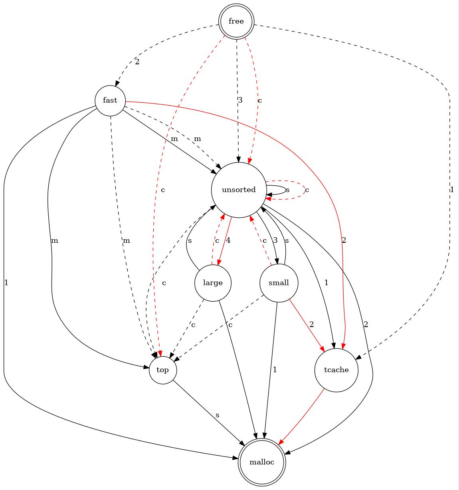
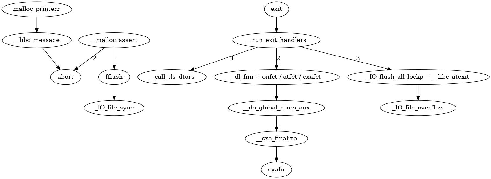

# Heap Pwn Cheat Sheet

## Transition

| symbol       | description                 |
|--------------|-----------------------------|
| arrow        | malloc                      |
| dotted arrow | free                        |
| red arrow    | weak path                   |
| c            | (for\|back)word consolidate |
| m            | malloc consolidate          |
| s            | split the chunk             |
| 1 ~ 4        | priority (1: high, 4: low)  |

| path                   | method | description                                                    |
|------------------------|--------|----------------------------------------------------------------|
| fast &rarr; malloc     | malloc | 1st chunk in fast bin when tcache is empty                     |
| fast &rarr; tcache     | malloc | 2nd ~ 8th chunks in fast bin when tcache is empty              |
| unsorted &rarr; tcache | malloc | 1st ~ 7th just-fit chunks in unsorted bin when tcache is empty |
| unsorted &rarr; malloc | malloc | 8th just-fit chunk in unsorted bin when tcache is empty        |
| small &rarr; malloc    | malloc | 1st chunk in small bin when tcache is empty                    |
| small &rarr; tcache    | malloc | 2nd ~ 8th chunks in unsorted bin when tcache is empty          |

## Bins

|          | size         | type |
|----------|--------------|------|
| tcache   | 0x20 ~ 0x410 | FILO |
| fast     | 0x20 ~ 0x80  | FILO |
| unsorted | 0x20 ~       | FIFO |
| small    | 0x20 ~ 0x3f0 | FIFO |
| large    | 0x400 ~      | FIFO |

## Mmap
The following conditions are required for mmap to be called.

`SIZE >= mp_.mmap_threshold && SIZE > main_arena->top.size`
however
`main_arena->top.size <= main_arena->system_mem`

Therefore, if you reserve a chunk with a size larger than 0x21000, mmap will be called.

| variable               | intial value |
|------------------------|--------------|
| mp_.mmap_threshold     | 0x20000      |
| main_arena->system_mem | 0x21000      |

## Double Free

| 1st \ nth               | tcahe | fast | unsorted |
|-------------------------|-------|------|----------|
| tcache                  | X     | X    | X        |
| fast                    | O     | O    | -        |
| unsorted [0x20 ~ 0x80]  | O     | O    | X        |
| unsorted [0x90 ~ 0x410] | O     | -    | X        |
| unsorted [0x420 ~]      | -     | -    | X        |
| small [0x20 ~ 0x80]     | O     | O    | X        |
| small [0x90 ~ 0x3f0]    | O     | -    | X        |
| large [0x400, 0x410]    | O     | -    | X        |
| large [0x420 ~]         | -     | -    | X        |

## Variables

| variable                                        | trigger                                         | memo                                                                                  |
|-------------------------------------------------|-------------------------------------------------|---------------------------------------------------------------------------------------|
| __malloc_hook                                   | malloc                                          |                                                                                       |
| __free_hook                                     | free                                            |                                                                                       |
| __realloc_hook                                  | realloc                                         |                                                                                       |
| __after_morecore_hook                           | sbrk                                            |                                                                                       |
| __malloc_initialize_hook                        | malloc (at initialization)                      |                                                                                       |
| __memalign_hook                                 | aligned_alloc, memalign, posix_memalign, valloc |                                                                                       |
| _dl_open_hook                                   | dlopen, dlsym                                   |                                                                                       |
| _rtld_global._dl_ns[0]._ns_loaded               | _dl_fini                                        | _rtld_global is in ld.so                                                              |
| global_max_fast                                 |                                                 |                                                                                       |
| .fini_array                                     |                                                 |
| __printf_arginfo_table, __printf_function_table | printf                                          |                                                                                       |
| stderr, fs:[0x30], vtable == _IO_cookie_jumps   | _IO_file_sync                                   | Whether stderr is in libc or exe depends on the code. debug and check __malloc_assert |
| __exit_funcs, fs:[0x30]                         | __run_exit_handlers                             |                                                                                       |
| tls_dtor_list, fs:[0x30]                        | __call_tls_dtors                                |                                                                                       |

